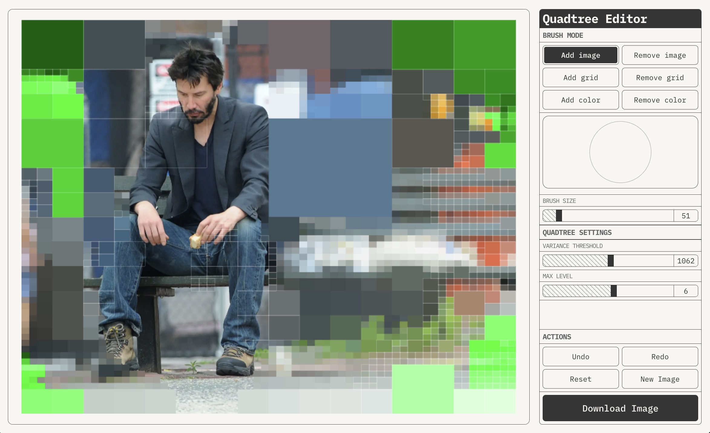

# Quadtree Image Effector

A web app that applies quadtree-based effects to pixalate images, and then allows users to selectively reveal the original image or grid structure through brushing interactions, before downloading the resulting image as a png. 

Latest build deployed to:

https://cameronfoxly.github.io/Quadtree-image-effector/



## Features

- **Image Upload**: Support for uploading and processing any image file
- **Interactive Brush Tools**: Two brush modes for interacting with the image:
  - Image Mode: Reveals the original image beneath the quadtree effect
  - Grid Mode: Shows grid structure with customizable outlines
- **Adjustable Parameters**:
  - Variance Threshold: Controls the detail level of the quadtree segmentation
  - Maximum Level: Sets the maximum depth of the quadtree subdivision
  - Outline Color: Customizable color for grid lines
  - Outline Width: Adjustable thickness of grid lines
  - Brush Size: Adjustable brush radius (use +/- keys or controls)
- **Real-time Preview**: See changes immediately as you adjust parameters
- **Download**: Export your processed image with all effects applied

## Technical Details

The application uses a quadtree algorithm to analyze and segment the image based on color variance. Each region is subdivided until either:
- The variance threshold is met
- The maximum subdivision level is reached

The quadtree structure enables efficient region selection and manipulation, allowing for smooth real-time interactions even with large images.

## Getting Started

1. Clone the repository
2. Install dependencies:
   ```bash
   npm install
   ```
3. Start the development server:
   ```bash
   npm run dev
   ```
4. Open your browser to the local development URL


## Built With

- React
- TypeScript
- Vite
- HTML Canvas API

## License

This project is licensed under the MIT License - see the LICENSE file for details.
